# US Payroll Platform — Product Specification
Version: 0.1 (repository-derived)
Date: 2025-12-16

## 1. Executive summary
US Payroll Platform is an enterprise-focused, Kotlin/JVM (Spring Boot) monorepo that implements a functional-core payroll engine surrounded by production-minded services for HR data, tax content/catalogs, labor standards, payrun orchestration, payment initiation, reporting, and filings.

Core product intent:
- Provide deterministic, testable paycheck calculations via a framework-agnostic domain library (`shared-kernel` + `payroll-domain`).
- Provide operationally safe payroll execution workflows via service boundaries (idempotency, outbox/inbox, DLQ replay/reconciliation).
- Allow statutory content (tax and labor rules) to be curated and updated as versioned artifacts in Git (CSV/JSON/SQL), with deterministic generation and validation.

Status and caveats:
- The repository is in active development and contains both implemented services and placeholder modules.
- Tax and labor content is primarily oriented around the 2025 ruleset, with explicit playbooks and pipelines for yearly updates.

## 2. Problem statement and purpose
Payroll correctness requires the intersection of:
- Employee facts (home/work jurisdiction, compensation, elections)
- Statutory rules (federal/state/local withholding, wage bases, caps)
- Labor standards (minimum wage, overtime thresholds, tip credit rules)
- Employer-specific configuration (earnings/deductions plans, overlays)
- Operational guarantees (retries, idempotency, auditability, traceability)

This repository’s purpose is to deliver a platform foundation that can compute paychecks deterministically and execute high-volume payruns safely, while supporting governance workflows for rapidly changing statutory content.

## 3. Intended users and stakeholders
Primary users:
- Payroll product and engineering teams building an internal payroll system.
- Operations/Compliance teams performing yearly statutory updates and audits.
- SRE/Platform teams operating multi-service deployments and incident workflows.

Secondary users:
- Downstream reporting/filings consumers that build projections from stable ledger events.
- Integrations teams implementing payment rails or exporting data.

## 4. Scope
### In scope
- Paycheck calculation and explainability (trace).
- Payrun orchestration (queue-driven finalization, idempotency keys, reconciliation helpers).
- Statutory content pipelines:
  - Tax content: CSV → JSON → DB catalog.
  - Labor standards: CSV → JSON + SQL.
- Payment initiation workflows with an explicit provider integration seam.
- Reporting/filings “shape” computations and ledger event contracts.
- Production-oriented operational controls: outbox/inbox, DLQ replay, SLO guidance, and security boundaries.

### Out of scope (current)
- A full enterprise-grade identity platform is not implemented in this repository (an `identity-service` module exists but is currently empty).
- Nationwide completeness for all state/local edge cases is explicitly a work in progress.

## 5. Key capabilities
### 5.1 Payroll calculation (functional core)
Core characteristics:
- Pure calculation logic expressed as functions over immutable domain types.
- No direct dependency on HTTP, databases, or Spring.
- Rich “explainability” via `CalculationTrace` and typed trace steps.

Core inputs/outputs:
- Inputs: `PaycheckInput` composed of `EmployeeSnapshot`, `PayPeriod`, `TimeSlice`, `TaxContext`, `YtdSnapshot`, labor standards context, and optional garnishment/support contexts.
- Outputs: `PaycheckResult` including earnings/taxes/deductions totals and trace.

**Supported employee and pay types (repository-derived):**
- Base pay models:
  - Salaried (annual salary allocated to a pay period based on pay frequency/schedule; supports optional proration).
  - Hourly (hourly rate multiplied by regular hours; supports separate overtime hours).
- Work patterns:
  - Full-time vs part-time is not a distinct enum in the domain; it is effectively represented by the employee’s base pay model (salary vs hourly) plus the provided hours/proration for the period.
  - Shift work is represented via hours and additional earnings rather than a dedicated “shift” type.
- Overtime:
  - Hourly overtime is supported via `TimeSlice.overtimeHours` and an `OvertimePolicy` (default multiplier 1.5; can be configured per employer earning definition).
- Tipped employees:
  - The domain models tipped employees via `EmployeeSnapshot.isTippedEmployee` and can enforce a minimum-wage “tip credit make-up” using `LaborStandardsContext` (federal baseline in-domain, with state/local standards supplied by labor-service).
- Supplemental/variable earnings:
  - Arbitrary additional earning lines can be supplied per period (`TimeSlice.otherEarnings`) and categorized (BONUS, COMMISSION, HOLIDAY, TIPS, etc.).
  - Off-cycle runs are modeled by setting `TimeSlice.includeBaseEarnings=false` and providing only the explicit earning lines.
- Tax-relevant employment classifications:
  - `EmploymentType` supports REGULAR, HOUSEHOLD, ELECTION_WORKER, AGRICULTURAL for certain tax rule differences.

Key domain subsystems (representative):
- Earnings calculation
- Tax basis computation + tax rule application
- Deductions/benefits with tax effects (pre-tax vs post-tax)
- Year-to-date accumulation

Primary location:
- `payroll-domain` (models under `com.example.uspayroll.payroll.model.*`, orchestration under `com.example.uspayroll.payroll.engine.*`)

### 5.1.1 Garnishment & support withholding subsystem
This repository includes an explicit garnishment calculation subsystem in the payroll domain plus HR-service endpoints for sourcing orders and recording withholding events.

**Supported order types (domain enum):**
- `CHILD_SUPPORT`
- `FEDERAL_TAX_LEVY`
- `STATE_TAX_LEVY`
- `STUDENT_LOAN`
- `CREDITOR_GARNISHMENT`
- `BANKRUPTCY`
- `OTHER`

**Federal baselines modeled today (repository-derived):**
- **Support (child/spousal) cap:** the payroll domain models the federal Consumer Credit Protection Act (CCPA, 15 U.S.C. § 1673(b)) cap as:
  - 50% when the obligor supports another spouse or child.
  - 60% when the obligor does not support another spouse or child.
  - +5 percentage points (to 55% / 65%) when arrears are at least 12 weeks.
- **Disposable earnings definition (for formulas):** by default, the domain computes disposable earnings as:
  - `baseDisposable = gross - mandatoryPreTaxDeductions`
  - `netForProtectedFloor = gross - mandatoryPreTaxDeductions - employeeTaxes`
  - Exception: for `STUDENT_LOAN`, the formula base also subtracts employee taxes (so the 15% ceiling applies to `gross - preTax - employeeTaxes`).

**State overlays implemented today:**
- **Michigan (MI):** modeled as an aggregate 50% support cap overlay in addition to the federal CCPA cap.
  - Effective cap for MI employees is `min(CCPA cap, 50% of disposable earnings)`.
- **CA / NV / NY:** currently modeled using the federal CCPA baseline parameters (no additional state aggregate cap overlay).

**Priority and allocation algorithm (high level):**
- **Ordering:** orders are processed in increasing `(priorityClass, sequenceWithinClass, orderId)`.
- **Requested amount:** each order computes a requested amount from a simple formula:
  - `PERCENT_OF_DISPOSABLE`
  - `FIXED_AMOUNT_PER_PERIOD`
  - `LESSER_OF_PERCENT_OR_AMOUNT`
  - `LEVY_WITH_BANDS` (statutory exemption bands)
- **Caps:** the requested amount is constrained by (when present):
  - Per-period cap (`DeductionPlan.perPeriodCap`) if a matching plan exists.
  - Annual cap (`DeductionPlan.annualCap`) using prior YTD.
  - Per-order `lifetimeCap` using prior YTD.
- **Aggregate support cap:** if `SupportCapContext` is provided and there are multiple `CHILD_SUPPORT` orders, the calculator:
  - Computes each support order’s requested amount.
  - Computes an aggregate cap (`computeSupportCap`) from disposable earnings.
  - If the cap binds, scales support orders proportionally, assigning any rounding remainder to the last support order.
- **Disposable ceiling:** across *all* orders, withholding cannot exceed remaining disposable earnings.
- **Protected earnings floor:** if an order has a `ProtectedEarningsRule`, it is enforced as a net-pay floor and may further reduce the order’s applied amount.
- **Arrears bookkeeping (per order):** if `arrearsBefore` is present, the calculator treats withholding as paying down arrears first (up to the arrears balance) and exposes current vs arrears splits in trace.

**Trace visibility (key steps):**
When `includeTrace=true`, the calculation emits typed trace steps including:
- `DisposableIncomeComputed`
- `SupportCapApplied`
- `ProtectedEarningsApplied`
- `GarnishmentApplied` (includes requested/applied/disposable-before/after and arrears splits)
- `DeductionApplied`

**HR API and ledger model (high level):**
- **Orders (worker contract):** HR exposes a read endpoint that returns `GarnishmentOrderDto` objects as-of a date.
  - `GET /employers/{employerId}/employees/{employeeId}/garnishments?asOf=YYYY-MM-DD`
  - Orders are primarily sourced from the `garnishment_order` table and enriched with statutory rule config (`garnishment-rules.json`) to obtain the final `formula` and optional `protectedEarningsRule`.
- **Withholding events (worker → HR):** worker records what was withheld per order per paycheck.
  - `POST /employers/{employerId}/employees/{employeeId}/garnishments/withholdings`
  - HR persists event history (`garnishment_withholding_event`) and maintains an aggregate ledger (`garnishment_ledger`), using a unique constraint on `(employer_id, employee_id, order_id, paycheck_id)` to prevent double counting.
  - HR runs reconciliation to update `garnishment_order.current_arrears_cents` and can auto-mark orders `COMPLETED` when remaining arrears reaches 0.
- **Ops visibility:** HR exposes a read-only ledger view for debugging.
  - `GET /employers/{employerId}/employees/{employeeId}/garnishments/ledger`

**Known limitations / not-yet-implemented (as of 2025-12-16):**
- The domain treats garnishment behavior as **data-driven** (orders + formulas + protected floors). It does not yet implement a full statutory rules engine for every garnishment type; correctness depends on curated formulas and protected floors (via HR rule config and per-order overrides).
- Only support (`CHILD_SUPPORT`) has an explicit aggregate cap subsystem; other order types do not yet have a comparable “federal baseline + state overlay” parameterization beyond what is expressed via formula/protected floor.

Diagram: orders → calculation → withholding ledger
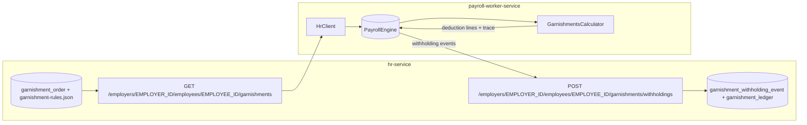

### 5.1.2 Tax basis computation subsystem
Tax calculation in this repository is driven by an explicit `Map<TaxBasis, Money>` computed inside the payroll domain. This makes “what wages are taxable?” a first-class, traceable artifact of the paycheck computation.

**Supported bases (domain enum):**
- `Gross`
- `FederalTaxable`
- `StateTaxable`
- `SocialSecurityWages`
- `MedicareWages`
- `SupplementalWages`
- `FutaWages`

**What goes into `Gross` vs cash gross:**
- The domain computes **tax bases from the full earnings list**, including imputed earnings.
- Separately, the paycheck’s **cash gross** (used for net pay) excludes imputed earnings.
  - Net cash is then computed from cash gross minus employee taxes and all deductions.

**Basis formulas (repository-derived; current behavior):**
- `Gross` = sum of **all** earning lines for the pay period.
- `SupplementalWages` = sum of earnings categorized as `SUPPLEMENTAL` or `BONUS`.
- `FederalTaxable` = `Gross - Σ(deductions with effect REDUCES_FEDERAL_TAXABLE)`.
- `StateTaxable` = `Gross - Σ(deductions with effect REDUCES_STATE_TAXABLE)`.
- `SocialSecurityWages` = `Gross - Σ(deductions with effect REDUCES_SOCIAL_SECURITY_WAGES)`.
- `MedicareWages` = `Gross - Σ(deductions with effect REDUCES_MEDICARE_WAGES)`.
- `FutaWages` = currently equal to `Gross` (placeholder for future FUTA-specific reduction semantics).

**How deduction effects drive the bases:**
- The basis builder consumes the engine’s computed deduction lines plus the employer’s `DeductionPlan` metadata.
- Each deduction plan has a `DeductionKind` plus an optional explicit `employeeEffects` set.
  - If `employeeEffects` is empty, the engine uses defaults by kind.
  - Examples of default behavior:
    - `PRETAX_RETIREMENT_EMPLOYEE` reduces federal + state taxable.
    - `HSA` reduces federal + state + Social Security wages + Medicare wages.
    - Most post-tax kinds (including garnishments) have `NO_TAX_EFFECT`.
- Fallback behavior for missing plans: if a deduction is treated as *pre-tax* in the engine pipeline but no plan is present in `plansByCode`, the basis builder reduces `FederalTaxable` (to preserve older tests / minimal configs).

**Trace visibility:**
- When trace is enabled, taxes computation emits a `BasisComputed` step per basis:
  - `basis = <TaxBasis>`
  - `components = { gross, less*Deductions, supplemental, holiday, imputed, ... }` (stable keys)
  - `result = <Money>`

**Known limitations / not-yet-implemented (as of 2025-12-16):**
- Basis computation does not (yet) apply wage base caps (e.g., Social Security cap) at the basis layer. Wage caps are handled at **tax rule application time** (e.g. `TaxRule.FlatRateTax.annualWageCap`).
- `FutaWages` does not yet reflect FUTA-specific pre-tax reductions; it currently mirrors `Gross`.
- Basis “components” are geared toward explainability (gross vs less deductions, supplemental/holiday/imputed rollups) rather than a full earnings-by-code decomposition.

Diagram: earnings + deductions → basis map → tax rules
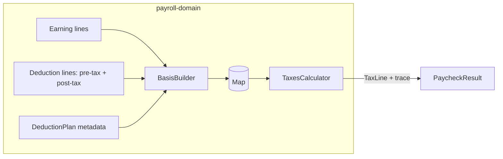

### 5.1.3 Tax rule application (basis consumption, locality allocation, caps)
Once bases are computed, the payroll domain applies tax rules from `TaxContext` to produce `TaxLine` outputs and `TaxApplied` trace steps.

**Supported tax rule shapes (domain):**
- `FlatRateTax` – `rate * taxableBasis`, with optional annual wage cap.
- `BracketedIncomeTax` – marginal brackets applied to the basis amount (with optional standard deduction and per-rule additional withholding).
- `WageBracketTax` – table lookup by basis amount, producing a fixed tax amount.

**TaxContext sources and output buckets:**
- Employee-side taxes are computed from:
  - `taxContext.federal + taxContext.state + taxContext.local`
- Employer-side taxes are computed from:
  - `taxContext.employerSpecific`

**Locality allocation for local taxes:**
- Local tax rules can carry an optional `localityFilter` string (e.g. `DETROIT`, `NYC`).
- For LOCAL-jurisdiction rules, the calculator allocates the basis across the set of selected localities:
  - Determine the set of distinct locality keys from local rules.
  - Resolve allocations from `TimeSlice.localityAllocations`:
    - If empty and there is one locality → 100% to that locality.
    - If empty and multiple localities → even split.
    - If provided → filter to known locality keys and normalize down only if the provided fractions sum to > 1.
  - Allocate cents using a “largest remainder” approach:
    - Take floor of `basis * fraction` for each locality.
    - Distribute remaining cents by descending fractional remainder (stable tiebreaker by locality key).
  - For a given local tax rule, use the allocated cents for the rule’s `localityFilter` key.

**Additional withholding (employee-elected extra per paycheck):**
- `EmployeeSnapshot.additionalWithholdingPerPeriod` is modeled as a generic extra amount that is applied **once**.
- In `TaxesCalculator`, this extra amount is applied to the **first** “federal income tax” rule encountered, defined as:
  - `jurisdiction.type == FEDERAL` and `basis in {Gross, FederalTaxable}`.
- The extra amount is surfaced in trace via `AdditionalWithholdingApplied`.

**Wage base caps and special cases:**
- Annual wage caps are enforced at *rule application time* for `FlatRateTax` via `annualWageCap` and prior YTD wages by basis.
  - Example use: Social Security wage base capping.
- FICA/Medicare skipping logic (rule suppression) is applied when the rule basis is `SocialSecurityWages` or `MedicareWages` and:
  - `EmployeeSnapshot.ficaExempt == true`, or
  - `EmployeeSnapshot.employmentType` is `HOUSEHOLD` or `ELECTION_WORKER` and the employee is still below the special YTD threshold.
- Additional Medicare (0.9%) is modeled as a special-case bracketed rule ID and applied only to the portion of wages above the IRS annual threshold, based on prior YTD Medicare wages.

**Trace visibility (key steps):**
- Per basis: `BasisComputed`
- Per applied tax: `TaxApplied` (includes brackets for bracketed income taxes)
- When employee-elected extra withholding is applied: `AdditionalWithholdingApplied`

Diagram: bases → employee rules + employer rules
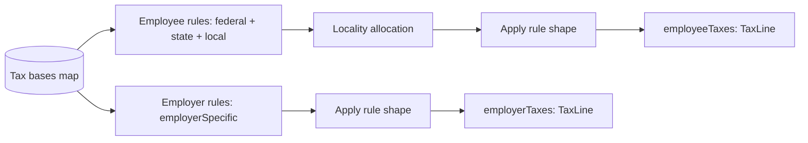

### 5.1.4 Federal income tax withholding (Pub. 15-T engine)
In addition to the generic “apply rules to bases” tax engine, this repository contains a dedicated subsystem for **federal income tax withholding (FIT)** that models key IRS Pub. 15-T behaviors (W-4 Step 2/3/4 inputs and nonresident alien adjustments) in a more explicit, testable way.

**High-level structure:**
- `payroll-domain` contains the pure, framework-free computation layer under `payroll.engine.pub15t.*`:
  - `WithholdingProfile` – normalized W-4 view (modern vs legacy)
  - `WithholdingProfiles` + `LegacyW4Bridge` – derive a `WithholdingProfile` from `EmployeeSnapshot`
  - `NraAdjustment` – per-frequency “extra wages” adjustments for nonresident aliens (NRA)
  - `FederalWithholdingEngine` – computes per-paycheck FIT using either percentage or wage-bracket method
- `tax-api` exposes an adapter-style service interface:
  - `FederalWithholdingCalculator` / `DefaultFederalWithholdingCalculator`
  - This adapter uses `EarningsCalculator` + `BasisBuilder` + `FederalWithholdingEngine`.

**Normalized W-4 inputs (`WithholdingProfile`):**
The Pub. 15-T engine operates on a `WithholdingProfile` derived from `EmployeeSnapshot`, including:
- `filingStatus`
- `step2MultipleJobs` (W-4 Step 2 checkbox)
- `step3AnnualCredit` (W-4 Step 3)
- `step4OtherIncomeAnnual` (W-4 Step 4a)
- `step4DeductionsAnnual` (W-4 Step 4b)
- `extraWithholdingPerPeriod` (W-4 Step 4c)
- `federalWithholdingExempt`
- `isNonresidentAlien` and `firstPaidBefore2020` (used for Pub. 15-T NRA tables)

**Legacy (pre-2020) W-4 bridge behavior (current state):**
- When the employee is treated as legacy (`W4Version.LEGACY_PRE_2020` or legacy fields are present), `LegacyW4Bridge` constructs a `WithholdingProfile` using a simplified Pub. 15-T “computational bridge” approach:
  - Derives synthetic Step 4(a) “other income” and Step 4(b) “deductions” values.
  - Uses an allowance constant (`$4,300` expressed in cents) to compute Step 4(b) from `legacyAllowances`.
  - Routes `legacyAdditionalWithholdingPerPeriod` into `extraWithholdingPerPeriod`.

**Nonresident alien (NRA) adjustment:**
- When `profile.isNonresidentAlien == true`, the engine adds a fixed “extra wages” amount (per pay frequency) to the *per-period* `FederalTaxable` basis **before** applying FIT.
- The adjustment uses one of two tables:
  - Table 1: pre-2020 W-4 and first paid before 2020
  - Table 2: 2020+ W-4 or first paid 2020 or later
- Note: the current `NraAdjustment` table values are explicitly marked as placeholders and are intended to be replaced with official year-specific values.

**Withholding methods supported by the engine:**
- **Percentage method** (`WithholdingMethod.PERCENTAGE`)
  - Selects a `TaxRule.BracketedIncomeTax` FIT rule based on:
    - `filingStatus`
    - `step2MultipleJobs` (prefers rule IDs containing `STEP2` when Step 2 is checked)
  - Annualizes the (possibly NRA-adjusted) per-period `FederalTaxable` wages using `periodsPerYear`.
  - Applies Step 4(a) / 4(b): `adjustedAnnualWages = annualWages + otherIncome - deductions`.
  - Computes annual tax by delegating to `TaxesCalculator` on a synthetic “annual period” input.
  - Applies Step 3 credits: `netAnnualTax = max(annualTax - step3Credits, 0)`.
  - De-annualizes: `perPeriodTax = netAnnualTax / periodsPerYear`.
  - Adds Step 4(c) extra withholding per period.
- **Wage-bracket method** (`WithholdingMethod.WAGE_BRACKET`)
  - Selects a `TaxRule.WageBracketTax` FIT rule using the same filing-status + Step 2 selection strategy.
  - Applies the wage-bracket table directly to per-period (possibly NRA-adjusted) `FederalTaxable` wages.
  - Adds Step 4(c) extra withholding per period.

**Trace visibility:**
- The Pub. 15-T engine emits trace as a sequence of `TraceStep.Note` messages documenting:
  - NRA extra wages applied
  - annualization inputs and adjusted annual wages
  - Step 3 credits and de-annualized per-period amounts

**Known limitations / not-yet-implemented (as of 2025-12-16):**
- The Pub. 15-T engine currently emits trace as `Note` messages (not as a fully typed trace structure specific to FIT).
- The legacy W-4 computational bridge is intentionally simplified and should be reviewed/extended for full parity with Pub. 15-T (it is designed to preserve inputs traceably while the bridge logic evolves).
- NRA adjustment amounts are flagged as placeholders pending authoritative year-specific table values.

### 5.1.5 Pub. 15-T wage-bracket tax content pipeline (CSV → JSON → DB)
While the Pub. 15-T withholding engine describes how federal FIT *should* be computed, the actual tables/rules are treated as **auditable, Git-managed artifacts** that can be updated yearly without changing runtime code.

**Artifacts (repository-derived):**
- Canonical curated CSV input (example year):
  - `tax-content/src/main/resources/wage-bracket-2025-biweekly.csv`
  - CSV schema: `frequency,filingStatus,variant,minCents,maxCents,taxCents`
- Deterministically generated JSON output:
  - `tax-content/src/main/resources/tax-config/federal-2025-pub15t-wage-bracket-biweekly.json`
- Metadata sidecars exist for curated inputs and are validated in CI (for supply-chain/audit hygiene):
  - `tax-content/src/main/resources/**/*.metadata.json`

**Generation and validation (Gradle tasks):**
- Generate wage-bracket JSON from curated CSV (year-parametric):
  - `./gradlew :tax-service:generateFederalPub15TWageBracketBiweekly -PtaxYear=2025`
  - Back-compat alias:
    - `./gradlew :tax-service:generateFederal2025BiweeklyWageBrackets`
- Validate tax config JSON structure:
  - `./gradlew :tax-service:validateTaxConfig`
- Validate curated CSV metadata:
  - `./gradlew :tax-service:validateTaxContentMetadata`
- Validate that generated JSON matches what would be produced from curated CSV:
  - `./gradlew :tax-service:validateGeneratedTaxArtifacts -PtaxYear=2025`

**Import into runtime catalog (DB):**
- JSON `TaxRuleFile` documents are imported into the `tax_rule` table via a framework-agnostic importer:
  - `tax-impl/src/main/kotlin/com/example/uspayroll/tax/persistence/TaxRuleConfigImporter.kt`
- Tax-service exposes the effective rules as a runtime `TaxContext` via:
  - `DbTaxCatalog` → `CachingTaxCatalog` → `CatalogBackedTaxContextProvider`

**How the generated tables are consumed:**
- `TaxesCalculator` can apply wage-bracket rules generically (it supports `TaxRule.WageBracketTax`).
- `FederalWithholdingEngine` (Pub. 15-T) selects a FIT rule by filing status (and Step 2 variant) and can use:
  - Percentage method rules (`TaxRule.BracketedIncomeTax`), or
  - Wage-bracket method rules (`TaxRule.WageBracketTax`) generated from the curated CSV.

**Optional / ancillary tooling:**
- The repo also includes an offline generator (`Pub15TWageBracketGenerator`) that derives a `WAGE_BRACKET` config by running the core tax engine over a wages grid against a canonical BRACKETED config. This is primarily used by tests/tools; the primary production-oriented pipeline is CSV → JSON.

Diagram: Pub. 15-T content flow (authoritative source → runtime behavior)
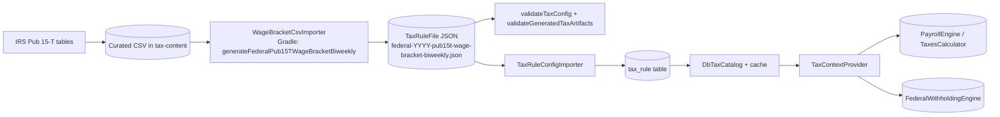

### 5.2 HR service (employee + pay period facts)
Capabilities:
- Exposes as-of employee snapshots and pay periods via HTTP routes.
- Contains endpoints for pay period lookup by check date.
- Includes garnishment endpoints used by worker-service for withholding events.

Primary location:
- `hr-service` (`/employers/{employerId}/employees/{employeeId}/snapshot`, `/pay-periods/...`)

### 5.3 Tax service (rules catalog → TaxContext)
Capabilities:
- Loads tax rules from a DB-backed catalog and returns an effective `TaxContext`.
- Supports optional employee-context filters (resident state, work state, localities) for rule selection.
- Supports employer-specific overlays layered on top of generic statutory rules.

Primary location:
- `tax-service` (`GET /employers/{employerId}/tax-context?asOf=...&residentState=...&workState=...&locality=...`)
- `tax-content` for curated inputs and generated JSON rule files.

### 5.4 Labor service (labor standards context)
Capabilities:
- Loads labor standards and returns a per-employer effective labor standards context.
- Supports locality codes (where present) and default baseline behavior.
- Includes a non-engineering-friendly CSV workflow and deterministic regeneration of JSON + SQL.

Primary location:
- `labor-service` (`GET /employers/{employerId}/labor-standards?asOf=...&state=...&homeState=...&locality=...`)

### 5.5 Payrun orchestration (queue-driven finalize + corrections)
Capabilities:
- Starts payrun finalization with idempotency keys.
- Queue-driven execution model: one job per employee item.
- Supports corrections workflows:
  - void
  - reissue
  - retro adjustments (adjustment runs)
- Provides reconciliation endpoints for operators (internal-only), including:
  - requeue queued/stale-running/failed items
  - force finalize and enqueue events
  - rebuild payment projections

Primary location:
- `payroll-orchestrator-service`

### 5.6 Worker service (compute + job consumption)
Capabilities:
- Computes paychecks by composing HR, Tax, and Labor contexts.
- Consumes per-employee finalization jobs (RabbitMQ) and performs paycheck computation as part of orchestrator-driven payruns.
- Exposes:
  - Demo endpoint (always available; intended for local experimentation):
    - `GET /dry-run-paychecks`
  - Optional, feature-flagged endpoints intended for testing/benchmarking:
    - Benchmark HR-backed computation:
      - `POST /benchmarks/employers/{employerId}/hr-backed-pay-period` (guarded by `worker.benchmarks.enabled` + shared token)
    - Legacy/dev-only finalize job API:
      - `POST /jobs/employers/{employerId}/payruns/finalize` (guarded by `worker.jobs.legacy-payrun.enabled`)
- Emits operational metrics for garnishment behavior.
- Provides DLQ replay tooling for RabbitMQ employee-finalize jobs (guarded by internal auth and disabled by default).

Diagram: worker endpoints taxonomy (what is always on vs feature-flagged)
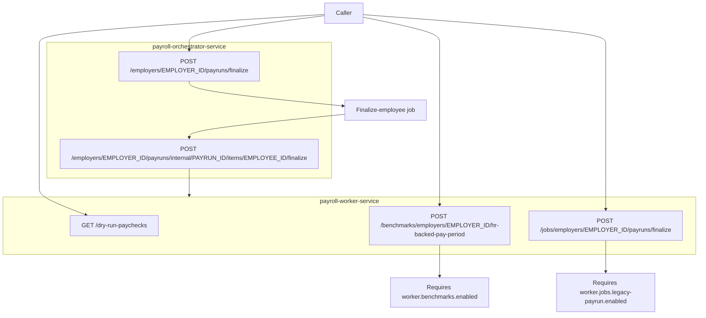

Primary location:
- `payroll-worker-service`

### 5.7 Payments service (system-of-record + provider seam)
Capabilities:
- Serves as system-of-record for payment batches and paycheck-level payment lifecycle.
- Integrates with payment rails via a strict provider port (`PaymentProvider`) that avoids raw bank PII.
- Supports reconciliation flows where orchestrator can rebuild projections from payments-service.

Primary location:
- `payments-service`

### 5.8 Reporting and filings
Capabilities:
- Defines stable ledger event contracts for downstream reporting/filings projections.
- Provides initial filing computations (941/940/W-2/W-3/state withholding summaries) as “shapes” based on ledger/projections.
- Provides validation hooks for readiness to compute filings.

Primary locations:
- `reporting-service`
- `filings-service` (`/employers/{employerId}/filings/...`)

### 5.9 Operational safety and governance
Capabilities:
- Deterministic idempotency strategies for external POST endpoints via `Idempotency-Key`.
- Outbox pattern for reliable publishing to Kafka and RabbitMQ.
- Inbox pattern for consumer-side de-duplication.
- Detailed runbooks for DLQ replay, reconciliation, yearly updates, and deployment hardening.

Primary locations:
- `docs/ops/idempotency-and-replay-invariants.md`
- `docs/ops/dlq-replay-reconciliation.md`
- `payroll-orchestrator-service` outbox relays
- `messaging-core` inbox utilities

## 6. Architecture
### 6.1 Repository structure and module inventory
This is a Gradle multi-module monorepo.

Core (functional core):
- `shared-kernel`
- `payroll-domain`

Service modules (implemented):
- `edge-service` (ingress gateway)
- `hr-api`, `hr-client`, `hr-service`
- `tax-api`, `tax-config`, `tax-catalog-ports`, `tax-impl`, `tax-content`, `tax-service`
- `labor-api`, `labor-service`
- `payroll-orchestrator-service`
- `payroll-worker-service`
- `payments-service`
- `reporting-service`
- `filings-service`

Shared infrastructure modules:
- `web-core` (web conventions, headers, problem details, redaction)
- `persistence-core` (DB building blocks)
- `messaging-core` (outbox/inbox, event types)
- `tenancy-core` (DB-per-employer routing)

Placeholder/empty modules currently included in settings but empty on disk:
- `identity-service`
- `integrations-service`
- `notification-service`
- `time-ingestion-service`
- `hr-domain`, `tax-domain`, `time-domain`

### 6.2 Runtime topology (multi-service)
Target runtime shape:
- `edge-service` is the only intended internet-exposed entrypoint.
- Internal services are deployed as private services, primarily reachable only from within the cluster/VPC.

Gateway routing:
- Edge routes all paths to worker-service by default (`edge-service/src/main/resources/application.yml`).

Representative internal dependencies:
- worker-service calls HR, Tax, and Labor services.
- orchestrator coordinates payrun lifecycle and uses RabbitMQ for per-employee finalization jobs.
- orchestrator publishes durable events via outbox to Kafka (reporting/filings and integration streams).
- payments-service processes payment batches via a provider integration seam.

Diagram: runtime topology (high-level)
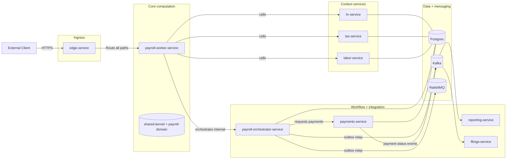

### 6.3 Data and tenancy model
Target tenant isolation:
- Database-per-employer (DB-per-tenant), per bounded context.

Implementation approach:
- Services use a routing datasource (`TenantRoutingDataSource`) keyed by a request-scoped tenant context.
- Tenant resolution is path-based for routes under `/employers/{employerId}/...`.

Diagram: DB-per-employer request routing (conceptual)
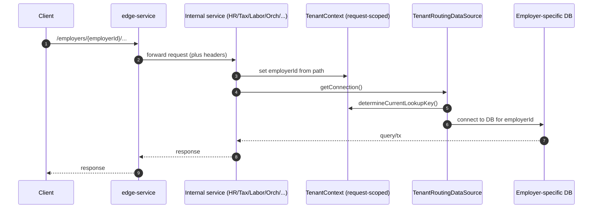

Operational implications:
- Tenant provisioning, migration, backup/restore are first-class operational workflows and are documented with baseline scripts.

Primary reference:
- `docs/tenancy-db-per-employer.md`

### 6.4 Messaging, outbox, inbox
Outbox pattern:
- Producers persist events in `outbox_event` and relays publish them to Kafka or RabbitMQ.
- Relays claim batches under DB locks and use lease tokens to remain correct under concurrency and crashes.

Inbox pattern:
- Kafka consumers are expected to de-duplicate via an inbox table keyed by `(consumer, event_id)`.

Diagram: outbox + inbox (replay-safe messaging)
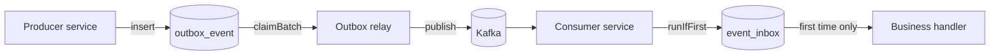

Primary references:
- `docs/ops/idempotency-and-replay-invariants.md`
- Outbox relay implementations in `payroll-orchestrator-service`.

### 6.5 Core workflows (high level)
#### Payrun finalize (queue-driven)
1) Client calls orchestrator: `POST /employers/{employerId}/payruns/finalize` with `Idempotency-Key`.
2) Orchestrator records payrun + per-employee items and enqueues one Rabbit job per employee via outbox.
3) Worker replicas consume jobs and call orchestrator internal endpoint:
   - `POST /employers/{employerId}/payruns/internal/{payRunId}/items/{employeeId}/finalize`
4) Orchestrator marks items succeeded/failed idempotently.
5) Orchestrator computes terminal status and, when approved, publishes durable ledger events.

Diagram: payrun finalize (queue-driven happy path)
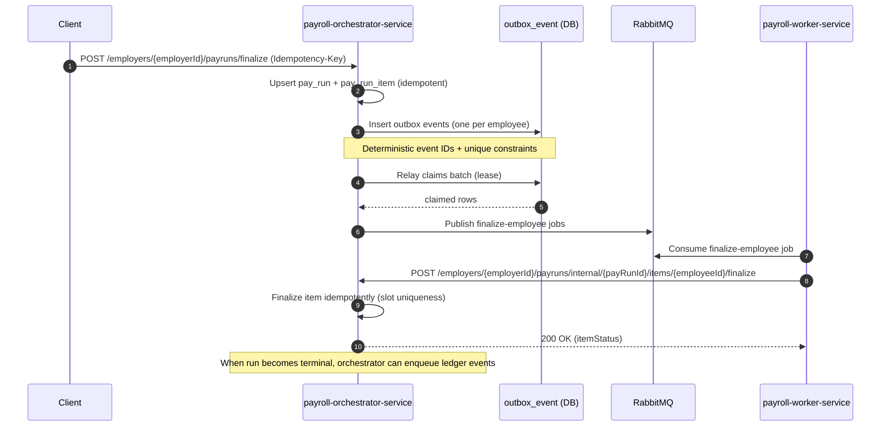

#### Corrections and retro
- Corrections are expressed as new payruns with explicit types (VOID/REISSUE/ADJUSTMENT) and sequences.
- Ledger events encode action semantics for downstream consumers.

Diagram: corrections model → ledger actions (consumer contract)
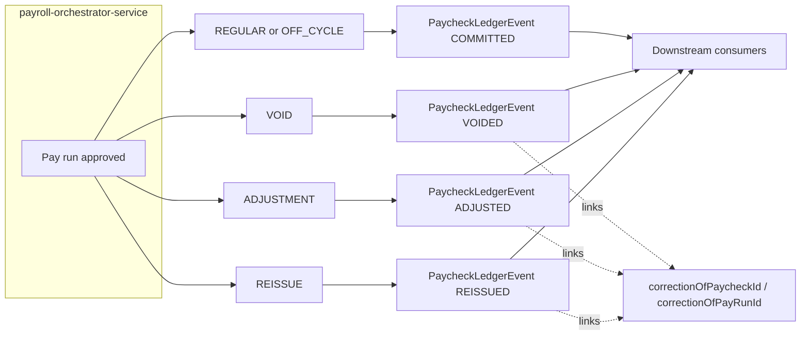

Primary reference:
- `docs/ops/reporting-filings-paycheck-ledger-events.md`

#### Payments initiation
- Orchestrator initiates payments with an idempotency key.
- Payments-service is system-of-record; orchestrator may maintain projections and can rebuild them.

## 7. Customization model
### 7.1 Employer-specific configuration
Tax overlays:
- Employer-specific tax overlays are modeled via `tax_rule.employer_id` and layered with generic rules.

Earnings and deductions:
- The domain consumes employer configuration via ports:
  - `EarningConfigRepository`
  - `DeductionConfigRepository`
- This allows a future config service (DB/UI) without changing the payroll engine.

Primary reference:
- `docs/employer-config.md`

### 7.2 Statutory content customization (policy/ops workflow)
Tax content:
- Canonical inputs in `tax-content/src/main/resources`.
- Deterministic generation into JSON `TaxRuleFile` documents under `tax-content/src/main/resources/tax-config`.
- Import into `tax_rule` via `TaxRuleConfigImporter`.

Labor standards:
- Canonical CSV under `labor-service/src/main/resources`.
- Deterministic generation into JSON + SQL via Gradle tasks or helper script.

Diagram: tax content pipeline (CSV → JSON → DB → runtime)
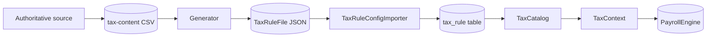

Diagram: labor standards pipeline (CSV → JSON + SQL)
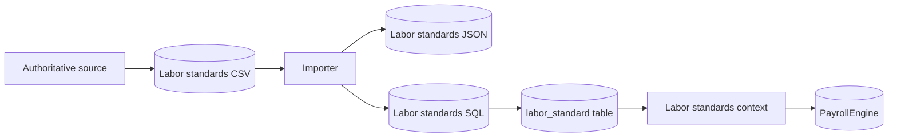

Primary references:
- `docs/tax-content-operations.md`
- `tax-service/README.md`
- `labor-service/README.md`

### 7.3 Deployment-time configuration
Key patterns:
- Spring Boot property namespaces per service.
- Explicit feature gates (many internal endpoints disabled by default).
- Separate configs for internal auth and gateway auth.

Examples:
- Edge auth modes: DISABLED (guarded), HS256 (dev), OIDC (production target).
- Worker internal replay endpoints require `worker.internal-auth.shared-secret`.
- Orchestrator internal endpoints can use internal JWT keyrings or shared secret headers.

Primary reference:
- `docs/security-boundary.md`
- `docs/ops/secrets-and-configuration.md`

## 8. Extensibility model
### 8.1 Adding new payroll calculations
- Add new domain models under `com.example.uspayroll.payroll.model.*`.
- Add new orchestration/calculation logic under `com.example.uspayroll.payroll.engine.*`.
- Preserve purity: side effects remain at service boundaries.

### 8.2 Adding new tax rules/jurisdictions
- Extend curated content (CSV/JSON) and pipelines in `tax-content`.
- Extend selection and persistence layers in `tax-service`/`tax-impl`.
- Add golden tests for statutory interpretation and year transitions.

### 8.3 Adding new labor standards
- Extend the labor standards CSV schema (engineering-owned), then update importer/generator.
- Add locality rows and extend DB schema as needed.

### 8.4 Integrating payment rails
- Implement `PaymentProvider` in `payments-service`.
- Keep bank/account details tokenized and outside events and core DB tables.
- Add asynchronous status update mechanisms for real providers.

Primary reference:
- `docs/ops/payments-provider-integration-seam.md`

### 8.5 Adding downstream consumers
- Prefer consuming stable ledger events (Kafka) rather than orchestrator internal tables.
- Use inbox de-duplication for replay safety.

Primary reference:
- `docs/ops/reporting-filings-paycheck-ledger-events.md`

## 9. Non-functional requirements and quality attributes
### 9.1 Correctness and determinism
- Payroll engine designed to be deterministic for a given set of inputs.
- Tax and labor pipelines are designed to be traceable from authoritative sources → curated CSV → generated JSON/SQL → DB → runtime behavior.

### 9.2 Reliability: idempotency and replay safety
Design commitments:
- Stable event IDs.
- Inbox de-duplication for Kafka consumers.
- Outbox claim/lease semantics safe under concurrency and crashes.
- Idempotency keys for client-facing “create work” POST endpoints.

Primary reference:
- `docs/ops/idempotency-and-replay-invariants.md`

### 9.3 Observability
- Structured logging conventions with correlation IDs.
- Metrics for key workflows (payrun finalization, garnishments, queue depth).
- SLO guidance with example PromQL queries and alert rules.
- Distributed tracing via OTLP exporter configuration.

Primary references:
- `docs/runtime-architecture.md`
- `docs/ops/slo-core-workflows.md`
- `docs/ops/payrun-jobs-observability.md`

### 9.4 Security
Boundary model:
- Ingress authn/authz at edge-service.
- Internal endpoints protected (shared secret or internal JWT), with a roadmap to mTLS.
- Reduced blast radius via DB-per-employer and least-privilege credentials.

Supply-chain posture:
- Dependency locking and verification metadata.
- Vulnerability scanning and SBOM generation.
- Code scanning (SAST) and DAST baseline.

Primary references:
- `docs/security-boundary.md`
- `docs/security-threat-model.md`
- `.github/workflows/security-scan.yml`
- `.github/workflows/dast.yml`

### 9.5 Compliance, PII, and retention
Baseline expectations:
- Avoid PII in logs (prefer stable IDs).
- Encrypt at rest/in transit via platform controls.
- Document retention/export/delete workflows.

Primary references:
- `docs/pii-and-retention.md`
- `docs/ops/retention-export-delete.md`

### 9.6 Enterprise-grade framework assessment (repository-derived)
This repository is best described as an **enterprise-grade payroll platform framework**: it contains many of the *engineering and operational primitives* you need for a tier-1 payroll system (determinism, replay-safety, content governance, security posture scaffolding) and it also now includes a meaningful set of enterprise workflow capabilities that are marked **Done** in the enterprise-readiness capability register (see Section 11.1).

What makes it “enterprise-grade” (as a framework)
- **Functional core / deterministic domain**: core calculations are isolated in `payroll-domain` and designed to be pure and testable.
- **Operational safety by default**:
  - HTTP idempotency conventions (`Idempotency-Key`) and DB uniqueness constraints for irreversible effects.
  - Outbox relays (Kafka + Rabbit) with correct claim/lease semantics.
  - Inbox de-duplication pattern for Kafka consumers.
  - DLQ replay and reconciliation runbooks + internal endpoints.
- **Content governance and traceability**: tax and labor policy data is treated as **versioned artifacts** (CSV/JSON/SQL) with deterministic generators and validation hooks.
- **Security boundary clarity**:
  - Edge/gateway is the intended ingress enforcement point.
  - Internal privileged endpoints are explicitly separated and guarded (shared secret / internal JWT scaffolding).
- **Production deployment posture**: Kubernetes baseline (probes, non-root, read-only FS, network policy stance) and supply-chain tooling (locking/verification, SBOMs, vuln scanning).

Important qualification
- “Enterprise-grade framework” here does **not** mean “fully enterprise complete”:
  - coverage breadth (all state/local edge cases) and multi-year backtesting are not fully complete,
  - identity service is currently a placeholder,
  - tenancy automation and production authn/authz wiring are still evolving per the repository’s enterprise-readiness capability register.

Codebase summary (what you’re actually getting)
- Language/runtime: Kotlin/JVM (Java 21), Spring Boot services, Gradle multi-module build.
- Architecture style: functional-core + ports/adapters; service boundaries for HR/Tax/Labor/Worker/Orchestrator/Payments.
- Operational primitives: outbox/inbox, idempotency keys, deterministic event IDs, replay tooling, runbooks.
- Delivery artifacts: Dockerfiles, Docker Compose stack, Kustomize overlays for dev/prod.

Code quality (signals present in the repository)
- Build hygiene and consistency:
  - `ktlint` + `detekt` wired across Kotlin subprojects.
  - JaCoCo coverage enforcement with per-module minimums.
  - Consistent “ports + adapters” wiring with domain purity preserved in `payroll-domain`.
- Test posture (representative):
  - Workflow/integration tests exist for key enterprise workflows (e.g., off-cycle, void/reissue, retro adjustments, reconciliation/projection rebuild, ledger events, filings shapes).
  - Golden/structural validators exist for curated tax/labor artifacts and metadata sidecars.
- Supply-chain posture:
  - Gradle dependency locking + verification metadata.
  - CI workflows for dependency scanning, SBOM generation/validation, and secret scanning.
- Ops/readiness documentation density:
  - runbooks for DR/restore, replay/reconciliation, yearly content updates, and production hardening.
  - Clear contributor hygiene guidance (e.g., generated `**/build/**` artifacts should not be treated as source docs).

Architecture quality (signals present in the repository)
- Clear separation between:
  - calculation domain (`payroll-domain`) vs
  - statutory catalogs/pipelines (tax/labor) vs
  - orchestration/workflows (orchestrator/worker) vs
  - ingress policy (edge).
- Strong bias toward **idempotent, replay-safe workflows**, which is a key differentiator for enterprise systems.
- Explicit “target state” documents (security boundary, tenancy model, SLOs) that reduce ambiguity for teams scaling the system.

Estimated replacement value (if rebuilt from scratch)
This is necessarily a **range estimate** because replacement cost depends on desired coverage breadth (all 50 states + locals), compliance posture (SOC2/ISO evidence, audits), and how much of the existing operational posture you want to match.

Assumptions for the estimate below
- Goal is “feature parity with this repository as it exists”, including:
  - enterprise HR system-of-record primitives (writes + bitemporal/effective dating + audit + idempotency)
  - tax/labor content pipelines + governance
  - orchestrator-driven payrun workflows (off-cycle, void/reissue, retro adjustments) and operational controls
  - payments service seam + reconciliation/projection rebuild helpers
  - reporting/filings event contracts and initial filings “shape” endpoints
  - outbox/inbox primitives + runbooks
  - edge auth scaffolding + deployment baselines
- A senior team familiar with Kotlin/Spring and distributed systems.
- Does not include external costs for legal/compliance audits or acquiring proprietary tax data.

Rough effort breakdown (engineering time)
- Functional payroll domain + explainability + core tests: ~4–8 engineer-months
- HR system-of-record (writes, effective dating/bitemporal, audit log, idempotency, pay schedules/period generation): ~4–8 engineer-months
- Tax catalog + CSV→JSON tooling + importer + validators + tests: ~4–8 engineer-months
- Labor standards tooling + importer + validators + tests: ~2–4 engineer-months
- Orchestrator + worker integration (queue-driven finalize, corrections, retro, reconciliation tools, workflow tests): ~7–14 engineer-months
- Payments service seam + reconciliation/projection rebuild support + tests: ~2–5 engineer-months
- Reporting/filings event contracts + initial filings “shapes” + tests: ~2–5 engineer-months
- Messaging core (outbox/inbox) + relays + retry semantics: ~3–6 engineer-months
- Edge gateway authn/authz scaffolding + header propagation: ~2–4 engineer-months
- Deployment baselines (Docker/K8s) + CI security/supply-chain posture + docs/runbooks: ~4–8 engineer-months

Total to reach comparable maturity: **~30–60 engineer-months** (roughly **2.5–5 engineer-years**).

Cost translation (very approximate)
- Using typical fully-loaded engineering costs (salary + benefits + overhead), this often lands in the ballpark of **$1.0M–$4.0M USD** to rebuild to comparable maturity.

This replacement estimate can be tailored to a specific target (e.g., “first production deployment for 3 states”, “nationwide withholding”, “SOC2-ready posture”) based on intended coverage and compliance goals.

## 10. Deployment and operations
### 10.1 Local development (Docker Compose)
- `docker-compose.yml` defines a local multi-service stack with Postgres and service containers.
- Edge is the primary exposed entrypoint.

### 10.2 Kubernetes (Kustomize)
- Baseline manifests under `deploy/k8s/base`.
- Overlays for `dev` and `prod` environments.
- Hardened defaults: non-root, read-only root filesystem, probes, network policies (prod overlay).

Primary references:
- `deploy/k8s/README.md`
- `docs/ops/production-deployment-hardening.md`

## 11. Known limitations and roadmap signals
As of 2025-12-16, the repository explicitly calls out:
- Year coverage primarily for 2025 tax and labor rules.
- Coverage breadth is not yet complete nationwide.
- Production-grade authn/authz and tenancy automation remain in progress.
- Some enterprise readiness work is still **Partial**, especially:
  - multi-jurisdiction employment scenarios (C3)
  - end-to-end “golden test” coverage audit (X0)

For the current enterprise-readiness capability register (Done/Partial/Not Started), see:
- `docs/ops/enterprise-readiness-capability-backlog.md` (capability register)

### 11.1 Enterprise-readiness capability snapshot (as of 2025-12-16)
Done:
- A0 HR write API + persistence for employee profile
- A1 Effective-dated employee attributes (beyond compensation)
- A2 Pay period management as a first-class workflow
- A3 Bitemporal HR (valid time + system time) OR explicitly-defined audit semantics
- B0 Content metadata + traceability standard
- B1 Formal approval workflow for content changes
- B2 Yearly update playbooks expanded to state tax + labor
- B3 Coverage expansion plan (state/local)
- C0 Off-cycle pay runs
- C1 Corrections: void / reissue
- C2 Retro pay driven by effective-dated HR changes
- D0 Payment reconciliation contract
- D1 Bank file / payment provider integration seam (sandbox provider)
- E0 Reporting/filings event contract
- E1 Quarterly/annual filing “shape” (initial shape APIs)

Partial:
- C3 Multi-jurisdiction employment scenarios
- X0 Golden tests coverage

Not Started:
- (none currently listed)

Diagram: enterprise-readiness status overview
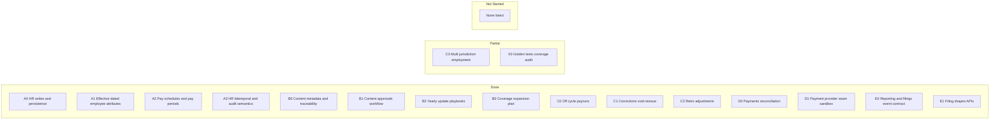

## 12. Appendix: key reference documents
Architecture:
- `docs/architecture.md`
- `docs/runtime-architecture.md`

Security:
- `docs/security-boundary.md`
- `docs/security-threat-model.md`
- `docs/security-privileged-ops.md`

Tax and labor content:
- `docs/tax-content-operations.md`
- `tax-service/README.md`
- `labor-service/README.md`

Ops:
- `docs/ops/idempotency-and-replay-invariants.md`
- `docs/ops/dlq-replay-reconciliation.md`
- `docs/ops/production-deployment-hardening.md`
- `docs/ops/secrets-and-configuration.md`
- `docs/ops/slo-core-workflows.md`

Repo hygiene / contributor guidance:
- `WARP.md` (includes guidance that `**/build/**` artifacts such as Detekt reports should not be treated as source docs)

Diagram: documentation vs generated artifacts
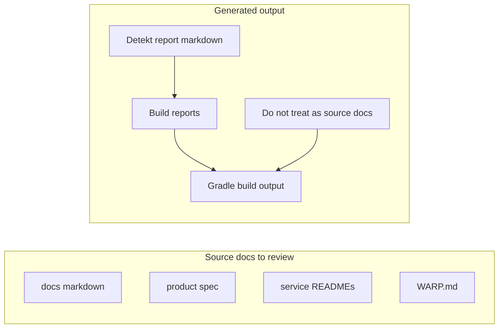

## 13. Payroll system feature review (repository vs typical expectations)
This appendix evaluates this repository against what a production payroll system is typically expected to provide.

Note: This appendix is an embedded copy of `docs/payroll-system-feature-review.md`. Its internal section numbering restarts at 1.

Date: 2025-12-16
Scope: repository-derived review of `us-payroll-platform`

## 1. How to read this document
This is a practical “gap and strengths” review of the repository against what a production payroll system is typically expected to provide.

For each area, you’ll see:
- What a payroll system is typically expected to support
- What this repository appears to implement today (based on code + docs)
- Notes / gaps / maturity signals

This is not a compliance certification and does not assert statutory completeness.

## 2. High-level: where this repository is strong
This repository is unusually strong (for its current maturity stage) in the engineering and ops primitives that are normally hard to retrofit later:
- Functional-core payroll computation (`payroll-domain`) separated from service concerns.
- Deterministic, replay-safe workflow semantics (Idempotency-Key, outbox/inbox, DLQ/reconciliation) – see `docs/ops/idempotency-and-replay-invariants.md` and `docs/ops/dlq-replay-reconciliation.md`.
- Content governance pipelines for tax and labor data (CSV → JSON → DB/SQL) with yearly-update playbooks.
- Multi-tenant isolation target of DB-per-employer with migration and ops scaffolding – see `docs/tenancy-db-per-employer.md`.
- Production posture scaffolding: hardened K8s baseline, supply-chain scanning, SBOM generation.

## 3. Feature-by-feature review
### 3.1 Employer / tenant model
Expected:
- Clear tenant boundary and isolation strategy
- Deterministic tenant routing in services
- Tenant-level export/retention/delete and DR readiness

In this repository:
- DB-per-employer tenant isolation is an explicit target (`docs/tenancy-db-per-employer.md`).
- Tenant routing is implemented via a routing datasource (`tenancy-core/src/main/kotlin/com/example/uspayroll/tenancy/db/TenantRoutingDataSource.kt`).
- Retention/export/delete posture is documented with scaffolding (`docs/ops/retention-export-delete.md`).
- DR/restore playbook exists (`docs/ops/backup-restore-dr.md`).

Notes / gaps:
- DB-per-employer is operationally heavy; the repository calls out the need for automation (provisioning, secrets, migrations).

### 3.2 HR system-of-record (employee facts)
Expected:
- Employee profile + work/home jurisdiction (for tax/labor)
- Effective-dated history and audit trail
- Deterministic “as-of” reads (for recompute and audits)

In this repository:
- Employee snapshot model is rich and payroll-relevant (`payroll-domain/.../EmployeeTypes.kt`).
- HR service exposes snapshot reads via HTTP (`hr-service/.../HrRoutes.kt`).
- Bitemporal + audit semantics are explicitly designed and documented (`docs/ops/hr-bitemporal-and-audit-semantics.md`).

Notes / gaps:
- The enterprise-readiness capability register now marks core HR write + effective dating + audit semantics as **Done** (A0–A3). Remaining work is primarily around breadth (additional HR attributes and validations), operator/admin workflows, and long-horizon backtesting.

### 3.3 Pay schedules and pay periods
Expected:
- Pay schedules (weekly/biweekly/semi-monthly/etc.)
- Pay period generation, validation, and stable identifiers
- Deterministic lookup by check date

In this repository:
- Pay frequencies are modeled (`payroll-domain/.../TimeTypes.kt`).
- HR service exposes pay period reads including by check date (`hr-service/.../HrRoutes.kt`).
- Pay-period validation rules and gap-free options are documented (`docs/ops/hr-pay-period-management.md`).

Notes / gaps:
- Pay schedule upsert + pay period generation/validation is present and marked **Done** (A2) in the enterprise-readiness capability register. Remaining work is typically around admin UX, more schedule variants, and operational controls.

### 3.4 Paycheck computation engine (functional core)
Expected:
- Deterministic paycheck calculation with explainability
- Support for common pay bases: salaried and hourly
- Handling of supplemental earnings
- Overtime and basic labor-rule hooks

In this repository:
- Salaried and hourly base compensation are first-class (`BaseCompensation` in `payroll-domain/.../EmployeeTypes.kt`).
- Per-period time/earnings inputs are modeled via `TimeSlice` with:
  - regular and overtime hours
  - additional earning inputs
  - ability to suppress base earnings for off-cycle runs (`includeBaseEarnings=false`) (`payroll-domain/.../TimeTypes.kt`).
- Overtime behavior is policy-driven (`payroll-domain/.../OvertimePolicy.kt`).
- Explainability exists via trace types and trace levels (see `payroll-domain/.../TraceTypes.kt` and `payroll-domain/.../audit/TraceLevel.kt`).

Notes / gaps:
- “Full-time / part-time / shift” aren’t explicit domain enums; they’re represented via salary vs hourly + hours/proration + earning lines.
- More complex time rules (multiple rates, blended overtime, union rules, job costing) are not indicated as complete.

### 3.5 Earnings catalog and earnings types
Expected:
- Employer-defined earning codes mapped to semantic categories (regular, OT, bonus, etc.)
- Support for “supplemental” earnings and different tax treatments

In this repository:
- System-level earning categories exist (`EarningCategory` in `payroll-domain/.../CommonTypes.kt`).
- The engine supports arbitrary additional earning lines per period (`TimeSlice.otherEarnings`).
- Employer-specific earning definitions are abstracted behind a repository port (see `docs/employer-config.md`).

Notes / gaps:
- A full “earning configuration service/UI” is not present; current wiring uses in-memory repositories in services.

### 3.6 Deductions and employer contributions (benefits)
Expected:
- Pre-tax and post-tax deductions (401k, HSA/FSA, etc.)
- Employer contributions
- Caps and per-period limits

In this repository:
- Deduction configuration is expressed via ports and domain models (`docs/employer-config.md`).
- Golden tests exist for employer-specific deduction differences (referenced in `docs/employer-config.md`).

Notes / gaps:
- A production-grade benefits enrollment/config system and persistence is not shown.

### 3.7 Taxes: rule modeling, catalogs, and withholding
Expected:
- Federal income tax withholding
- FICA (SS/Medicare + Additional Medicare)
- State income tax withholding
- Local income taxes in select jurisdictions
- Employer taxes (FUTA/SUTA/SDI) depending on scope
- Yearly update workflow for statutory changes

In this repository:
- Tax rules are modeled as data (TaxRule/TaxContext) and served via `tax-service` (`tax-service/.../TaxRoutes.kt`).
- Tax content workflows exist:
  - Federal Pub 15-T wage bracket pipeline (see `docs/tax-content-operations.md`).
  - State income tax pipeline (CSV → JSON → DB) documented in `tax-service/README.md`.
- Employer-specific overlays are supported via `tax_rule.employer_id` and layered selection (`docs/employer-config.md`).
- Tests exist for federal withholding and for local/jurisdiction selection semantics (multiple golden tests under `tax-service/src/test`).

Notes / gaps:
- The repository README explicitly says coverage breadth and multi-year support are not complete (`README.md`).
- A payroll system typically needs broader tax surfaces (SUI/SDI, reciprocal agreements, local edge cases); this repository has the scaffolding and some coverage but is not presented as nationwide-complete.

### 3.8 Labor standards
Expected:
- Minimum wage (federal + state/local)
- Overtime thresholds and special rules
- Tipped wage / tip credit rules where applicable

In this repository:
- Labor standards are provided as a service boundary (`labor-service`) and maintained as CSV with deterministic JSON + SQL regeneration (`labor-service/README.md`).
- The domain has a tip-credit “make-up” enforcer for tipped employees given a labor standards context (`payroll-domain/.../TipCreditEnforcer.kt`).

Notes / gaps:
- Labor standards coverage is described as evolving; state/local complexity will require continued expansion.

### 3.9 Garnishments (including support)
Expected:
- Garnishment orders and withholding calculation
- Protected earnings floors, state-specific rules, and support caps
- Operational reconciliation and error handling

In this repository:
- Garnishment modeling and a substantial calculator + test suite exist in the domain (`payroll-domain/.../GarnishmentsCalculator.kt` and tests).
- HR service owns garnishment orders and a ledger, including migrations and validation (`hr-service/.../garnishment/*` and `hr-service/src/main/resources/db/migration/hr/*garnishment*`).
- Worker service records withholding events back to HR; replay tooling and metrics exist (`payroll-worker-service/README.md`).

Notes / gaps:
- A fully “all states, all order types” garnishment product is typically extensive; this repository contains meaningful groundwork plus ops hooks.

### 3.10 Payruns (batch payroll execution)
Expected:
- Run payroll for many employees for a period
- Scale-out execution model
- Idempotent APIs and safe retries
- Clear “status” views and operator controls

In this repository:
- Orchestrator exposes payrun lifecycle endpoints with idempotency keys (`payroll-orchestrator-service/.../PayRunController.kt`).
- Execution is designed as queue-driven per-employee jobs (RabbitMQ) with DLQ and reconciliation workflows (see `docs/ops/payrun-jobs-observability.md` and `docs/ops/dlq-replay-reconciliation.md`).
- Worker has job controllers and internal replay mechanisms (guarded by internal auth).

Notes / gaps:
- This is one of the most production-oriented parts of the repository; the remaining gaps are more about “business breadth” and governance, not core mechanics.

### 3.11 Corrections: void, reissue, retro
Expected:
- Ability to void and reissue paychecks
- Retroactive adjustments when HR facts change
- Clear ledger semantics for downstream reporting

In this repository:
- VOID and REISSUE are implemented and documented (`docs/ops/payrun-corrections-void-reissue.md`).
- Retro adjustment workflows exist in orchestrator (tests indicate a workflow exists, e.g. `PayRunRetroAdjustmentWorkflowIT`).
- Ledger semantics are formalized for downstream consumers (`docs/ops/reporting-filings-paycheck-ledger-events.md`).

Notes / gaps:
- Corrections are currently modeled as deterministic clones/negations rather than re-computing from potentially changed historical inputs (explicitly called out as a limitation).

### 3.12 Payments / money movement
Expected:
- Payment initiation per paycheck
- Provider integration (ACH/check/wire) with safe handling of banking PII
- Reconciliation and lifecycle tracking

In this repository:
- Payments-service exists as system-of-record with a provider integration seam (`payments-service/.../provider/PaymentProvider.kt`).
- The seam explicitly avoids raw account/routing numbers; docs call for tokenization (`docs/ops/payments-provider-integration-seam.md`).
- Orchestrator can rebuild projections from payments-service (internal reconciliation endpoints).

Notes / gaps:
- A real ACH/direct-deposit provider integration is not implemented here; the repository provides the seam and sandbox-like behaviors.

### 3.13 Reporting and filings
Expected:
- Stable payroll ledger for reporting and compliance
- Filing “shapes” (941/940/W-2/W-3, state summaries)
- Deterministic recomputation / audit support

In this repository:
- A stable paycheck ledger event contract is defined for downstream consumers (`docs/ops/reporting-filings-paycheck-ledger-events.md`).
- Filings-service exposes endpoints for 941/940/W-2/W-3 and state withholding summaries (`filings-service/.../FilingsController.kt`).

Notes / gaps:
- Filing generation in practice requires deep validation, per-jurisdiction rules, and reconciliation with payments; this repository has early structure and integration seams.

### 3.14 Security and identity
Expected:
- Authentication and authorization at ingress
- Tenant scoping enforcement
- Privileged operation controls and audit logs

In this repository:
- Edge service enforces JWT-based authorization and employer scoping (`edge-service/.../EdgeAuthorizationFilter.kt`).
- Internal privileged endpoints are guarded via internal auth (shared secret/JWT scaffolding) and security audit logging (`docs/security-boundary.md`, `docs/security-threat-model.md`).

Notes / gaps:
- `identity-service` module exists but is currently empty; production deployments need an IdP integration and hardened policies.

### 3.15 Observability and ops readiness
Expected:
- Metrics, logs, traces for core workflows
- Operator runbooks, SLOs, alerting

In this repository:
- SLO guidance and PromQL examples exist (`docs/ops/slo-core-workflows.md`).
- Payrun job observability is documented (`docs/ops/payrun-jobs-observability.md`).
- Trace propagation concepts are documented and OTLP config exists in service configs.

Notes / gaps:
- Production-grade dashboards/alerts and organization-specific on-call runbooks typically need tailoring, but the repository has strong starting templates.

### 3.16 Supply-chain and build quality
Expected:
- Dependency hygiene, vulnerability scanning, SBOMs

In this repository:
- Dependency locking + verification metadata and CI checks.
- OWASP Dependency-Check, Trivy, TruffleHog, CodeQL workflows exist under `.github/workflows/`.

## 4. Summary: what the repository “already is” vs “what remains”
Already present (strong foundation)
- Functional payroll engine with traceability
- Tax/labor content pipelines and year-update posture
- Garnishment modeling and ops hooks
- Queue-driven payrun execution with replay-safe primitives
- Payment integration seam with strong security stance on bank PII
- Filing/reporting contracts and early filing endpoints
- Security boundary plan + gateway enforcement model
- Multi-tenant DB-per-employer target + ops runbooks

Likely remaining work for a production payroll system
- Broader statutory coverage (state/local edge cases; multi-year backtesting)
- HR admin workflows and breadth hardening (more attributes, validations, and enterprise-grade audit/PII controls)
- Real payment provider integrations and settlement/returns pipelines
- Deeper filings compliance logic, validations, and reconciliation workflows
- Tenancy provisioning automation and hardened secrets management integration
- End-to-end identity/authorization integration across all services

A companion “prioritized gap list” aligned to a first enterprise go-live (P0/P1) can be produced by mapping this review to the enterprise-readiness capability register at `docs/ops/enterprise-readiness-capability-backlog.md`.
